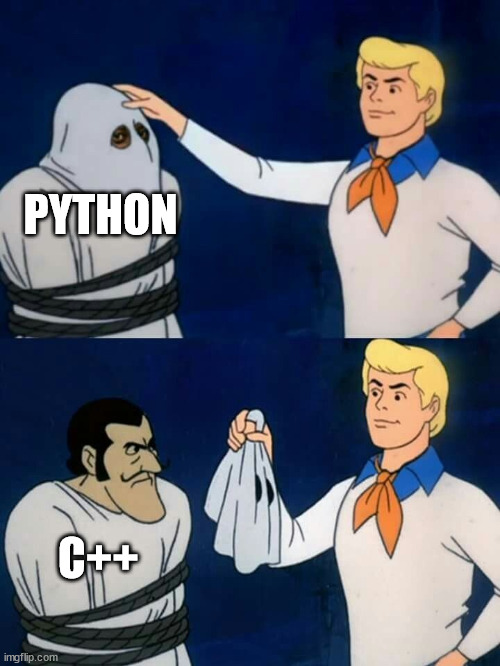

``#vent`` Demystifying C++
--------------------------

.. warning::
   Anything below this point is just me venting about topics that frequently come up when C++ is mentioned.

But, C++ is difficult
^^^^^^^^^^^^^^^^^^^^^

I think C++ organically follows `Bushnell's Law <https://en.wikipedia.org/wiki/Bushnell%27s_Law>`_, adjusted for the topic

   All the best [programming languages] are easy to learn and difficult to master. They should reward the first quarter and the hundredth.

Beauty is in the eye of the beholder, but soon enough, if you're doing anything state-of-the-art, you'll hit performance bottlenecks with Python (and friends) that will naturally pull you towards C++.

But with Python, we don't need C++
^^^^^^^^^^^^^^^^^^^^^^^^^^^^^^^^^^

This makes me feel like breaking the news to someone that Santa isn't real, but just as an example, see `numpy <https://numpy.org/doc/stable/user/whatisnumpy.html>`_ and `PyTorch <https://pytorch.org/tutorials/advanced/cpp_frontend.html>`_.

Why is NumPy Fast?
   [...] these things are taking place, of course, just “behind the scenes” in optimized, pre-compiled C code [...]

Using the PyTorch C++ Frontend
   [...] While the primary interface to PyTorch naturally is Python, this Python API sits atop a substantial C++ codebase providing foundational data structures and functionality such as tensors and automatic differentiation. [...]

The memefied version of this discussion is

Why use C++ if it sucks??
^^^^^^^^^^^^^^^^^^^^^^^^^
  
There's much folklore around C++. "C is faster than C++." "C++ is unsafe" (I'm looking at you, Rust). 
Anyhow, we'd all benefit if people stopped spreading weird fallacies about the C++ language when the problems they have can usually be attributed instead to a `skill issue <https://knowyourmeme.com/memes/skill-issue-simply-a-difference-in-skill>`_.
Some quick info from `Stroustrup's FAQ <https://www.stroustrup.com/bs_faq.html>`_, also known as the person who designed and implemented the C++ programming language.

``<begin Stroustrup's FAQ quote>``
  
What is the difference between C and C++?
  C++ is a direct descendant of C that retains almost all of C as a subset. C++ provides stronger type checking than C and directly supports a wider range of programming styles than C. C++ is "a better C" in the sense that it supports the styles of programming done using C with better type checking and more notational support (without loss of efficiency). In the same sense, ANSI C is a better C than K&R C. In addition, C++ supports data abstraction, object-oriented programming, and generic programming (see my books).
  I have never seen a program that could be expressed better in C than in C++ (and I don't think such a program could exist - every construct in C has an obvious C++ equivalent). [...]
  
C++ is low-level?
  No. C++ offers both low-level and high-level features. C++ has low-level parts, such as pointers, arrays, and casts. These facilities are (almost identical to what C offers) are essential (in some form or other) for close-to-the-hardware work. So, if you want low-level language facilities, yes C++ provides a well-tried set of facilities for you. However, when you don't want to use low-level features, you don't need to use the C++ facilities (directly). Instead, you can rely on higher-level facilities, including libraries. For example, if you don't want to use arrays and pointers, standard library strings and containers are (better) alternatives in many cases. If you use only low-level facilities, you are almost certainly wasting time and complicating maintenance without performance advantages (see Learning Standard C++ as a New Language). You may also be laying your systems open to attacks (e.g. buffer overflows).

C++ too slow for low-level work?
  No. If you can afford to use C, you can afford to use C++, even the higher-level facilities of C++ where you need their functionality. See Abstraction and the C++ machine model and the ISO C++ standards committee's Technical Report on Performance.

C++ is useful only if you write truly object-oriented code?
  No. That is, "no" for just about any reasonable definition of "object-oriented". C++ provides support for a wide variety of needs, not just for one style or for one kind of application. In fact, compared to C, C++ provides more support for very simple programming tasks. For example, the standard library and other libraries radically simplifies many otherwise tedious and error-prone tasks. C++ is widely used for huge applications but it also provides benefits for even tiny programming tasks. 

``<end Stroustrup's FAQ quote>``
  
But I hate pointers, and pointers hate me: The ballad of ``segmentation fault (core dumped)``
^^^^^^^^^^^^^^^^^^^^^^^^^^^^^^^^^^^^^^^^^^^^^^^^^^^^^^^^^^^^^^^^^^^^^^^^^^^^^^^^^^^^^^^^^^^^^

In things entirely written in modern C++ (loosely C++11 and above, but C++14 and above for what I want to say here), you shouldn't see any ``new`` or any loose raw pointer modifiers ``*``.

Use `smart pointers <https://en.cppreference.com/w/cpp/memory>`_. In general, `std::shared_ptr <https://en.cppreference.com/w/cpp/memory/shared_ptr>`_ and, if needed, `std::unique_ptr <https://en.cppreference.com/w/cpp/memory/unique_ptr>`_.

If only using smart pointers you still manage to get a segmentation fault, then hats off to you.

But I can get segfaults with ``std::vector``
^^^^^^^^^^^^^^^^^^^^^^^^^^^^^^^^^^^^^^^^^^^^

As a successor of C, the standard library in C++ kept some of its predecessor's behavior of not generating exceptions.

For example, with trigonometric functions in C++, the error handling is `C-like <https://en.cppreference.com/w/cpp/numeric/math/math_errhandling>`_

For instance getting the ``acos`` of 1.1, which is invalid, will fail silently in C++. We must check if the output is ``NaN``, e.g. with

.. code-block:: cpp

   #include <cmath>
   #include <iostream>

   int main()
   {
     auto a = std::acos(1.1);
     std::cout << std::isnan(a) ? "the output was invalid but no exception was thrown " : a << std::endl;
   }

the same applies if we try to access beyond a vector's limits with the good and old ``operator[]``.
Instead of doing that, use the method ``.at()``, which `checks the bounds <https://en.cppreference.com/w/cpp/container/vector/at>`_.

.. code-block:: cpp

   #include <iostream>
   #include <vector>
   #include <exception>

   int main()
   {
     auto v = {1.0,2.0,3.0,4.0};
     try
     {
       std::cout << v.at(22) << std::endl;
     }
     catch (const std::out_of_range& e)
     {
       std::cout << e.what() << std::endl;
     }
   }  

As a conclusion, find the correct function/method or throw an exception yourself.

.. _Perfect forwarding:

But C++ makes too many copies of objects: The sonata of "I don't know `perfect forwarding <https://en.cppreference.com/w/cpp/utility/forward>`_"
^^^^^^^^^^^^^^^^^^^^^^^^^^^^^^^^^^^^^^^^^^^^^^^^^^^^^^^^^^^^^^^^^^^^^^^^^^^^^^^^^^^^^^^^^^^^^^^^^^^^^^^^^^^^^^^^^^^^^^^^^^^^^^^^^^^^^^^^^^^^^^^^

I see this claim all the time and it has many `skill-issue <https://knowyourmeme.com/memes/skill-issue-simply-a-difference-in-skill>`_\ -related causes, but basically, it shows up more frequently in the constructors of ``std::vector`` and ``std::shared_ptr``.

Let's suppose that we have a class

.. code-block:: cpp

   class Potato{
     private:
       double size_;
     public:
       Potato(const double& size):
       size_(size)
       {}; 
   };
  
for which we want to get a ``std::shared_ptr``. Do not do this

.. code-block:: cpp

   auto potato_ptr = std::make_shared<Potato>(Potato(20.0));

.. warning::

   This is not the only issue you can have by doing this.
   It can generate all sorts of issues, in particular with classes that are not copyable.

because that will create one instance of ``Potato(20.0)``, just to copy it when creating the ``std::shared_ptr``. Do this, instead

.. code-block:: cpp

   auto potato_ptr = std::make_shared<Potato>(20.0);

by forwarding the argument to the constructor instead of calling it explicitly. 
  
For everything else that you don't want to copy, use ``std::move()``, but you don't see it that much unless you're designing a library.
