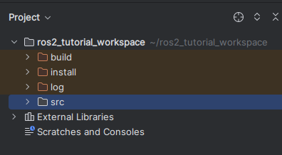

Using :program:`PyCharm` for ROS2 sources
=========================================

With :program:`PyCharm` opened as instructed in :ref:`Editing Python source`, here are a few tips to make your life easier.

1. Go to :menuselection:`File --> Open...` and browse to our workspace folder :file:`~/ros2_tutorial_workspace`
2. Right-click the folder :file:`install` and choose :menuselection:`Mark Directory as --> Excluded`. Do the same for :file:`build` and :file:`log`

Your project view should look like so

Running a Node from :program:`PyCharm`
-------------------------------------

With the project correctly configured, you can

1. move to :menuselection:`src --> python_package_with_a_node --> python_package_with_a_node`.
2. double (left) click :program:`sample_python_node.py` to open the source code, showing the contents of the Node. It is minimal to the point that it doesn't have anything related to :program:`ROS` at all.

.. literalinclude:: ../../ros2_tutorial_workspace/src/python_package_with_a_node/sample_python_node.py
   :language: python
   :linenos:
3. right click :program:`sample_python_node.py` and choose :menuselection:`Debug sample_python_node`

It will output in :program:`PyCharm`'s console

.. code :: console
   
    Hi from python_package_with_a_node.
    
.. note:: 

   You should extensively use the Debugger in :program:`PyCharm` when developing code. If you're still adding :code:`print` functions to figure out what is wrong with your code, now is the opportunity you always needed to stop doing that and join the adult table.

.. note::

   You can read more about debugging with :program:`PyCharm` at the `official documentation <https://www.jetbrains.com/help/pycharm/debugging-your-first-python-application.html#where-is-the-problem>`_.

.. _PyCharm is not finding the dependencies:

What to do when :program:`PyCharm` does not find the dependencies
-----------------------------------------------------------------

.. note::

   This section is meant to help you troubleshoot if this ever happens to you. It can be safely skipped if you're following the tutorial for the first time.

.. note::

   There might be ways to adjust the settings of :program:`PyCharm` or other IDEs to save us from the trouble of having to do this. Nonetheless, this is the *one-size-fits-most* solution, which should work for all past and future versions of :program:`PyCharm`.

If you have ruled out all issues related to your own code, it might be the case that the terminal in which you initially ran :program:`PyCharm` is unaware of certain changes to your ROS2 workspace.

To be sure that the current :program:`PyCharm` session is updated without changes to any settings, do

#. Close :program:`PyCharm`.
#. Build and source the ROS2 workspace.
  
   .. include:: the_canonical_build_command.rst
   
#. Re-open :program:`PyCharm`.

   .. code :: console

    pycharm_ros2
   
