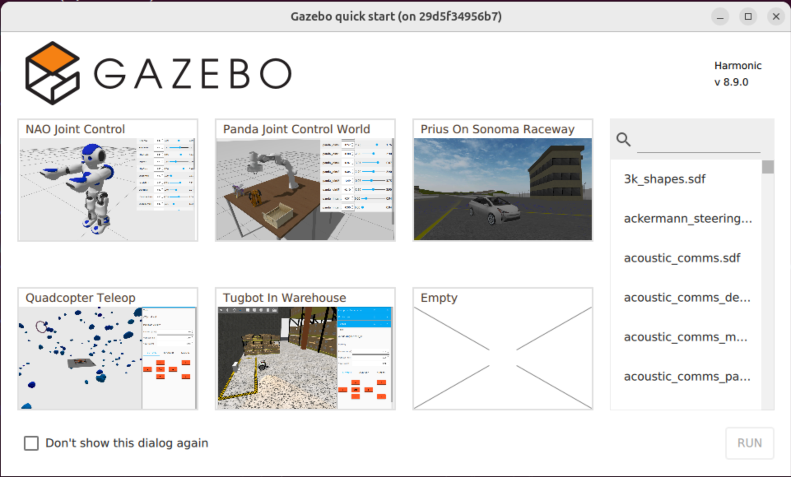

.. include:: ../the_topic_is_under_heavy_construction.rst

:program:`Gazebo` quickstart
============================

.. note::

   Click here for the `official docs <https://gazebosim.org/docs/harmonic/getstarted/>`_ from the developers of :program:`Gazebo`.

:program:`Gazebo` is a robot simulator frequently mentioned when :program:`ROS2` is used. They are officially different projects although there are `clear connections <https://gazebosim.org/docs/latest/ros_installation/#summary-of-compatible-ros-and-gazebo-combinations>`_.

Until :program:`ROS2 Humble`, :program:`Gazebo` worked in a different way and had a different name. The older project has been renamed to :program:`Gazebo Classic`.

Given that this new way to use :program:`Gazebo` has started in :program:`ROS2 Jazzy`, we can expect that some edges will be rough and some functionalities missing. Nonetheless, it is reasonable to believe this will be the way to operate :program:`Gazebo` in the foreseable future.

For :program:`ROS2 Jazzy`, we use :program:`Gazebo Harmonic`. This replicates the strategy of having a LTS version for a given piece of software. This makes it easier for the users to learn and trust a platform without it constantly changing.

Beauty and usability are in the eyes of the beholder. That said, one major improvement in :program:`Gazebo` is the motion towards not needing two robot description formats. It has always been the case that a robot would have to be described twice, once for :program:`ROS2` and another for :program:`Gazebo Classic`.
Although this switch might still be ongoing and some more advanced functionalities might be missing, we will work with a single ``.sdf`` file as much as possible in these tutorials.

.. _Gazebo installation:

:program:`Gazebo` Installation
------------------------------

The following command will install :program:`Gazebo Harmonic` and all the pairing libraries for :program:`ROS2 Jazzy`.

.. rli:: https://raw.githubusercontent.com/UoMMScRobotics/SFR_Gazebo/refs/heads/main/install_gazebo.sh
   :language: bash
   :lines: 5-15

Here is the description of the packages we are installing. You can notice that the packages are being used in the commands to add the :program:`Gazebo Harmonic` packages to our :program:`apt` sources.

===========================   =================================================================================================================================================
curl_                         Helps download files from the terminal.
`lsb-release`_                The lsb_release command is a simple tool to help identify the Linux distribution being used and its compliance with the Linux Standard Base
gnupg_                        :program:`GnuPG` is an universal crypto engine which can be used directly from a command line prompt, from shell scripts, or from other programs.
===========================   =================================================================================================================================================

Running :program:`Gazebo`
-------------------------

After installation, :program:`Gazebo Harmonic` can be run with the following command

.. code-block:: console

    gz sim

Which should result in something similar to the following, if the installation went well.
I would recommend strongly against letting the curiosity get the best of you and clicking on the ``3d_shapes.sdf`` given that it's current freezing all my machines.
Other scenes seem to be working in general.

Basic functionality
-------------------

These two official tutorials cover the basic functionality of :program:`Gazebo`. They are very well made with up-to-date images and videos. Please go through them to familiarise yourself with the basic functionality.

.. hint::

    In the ``Understanding the GUI`` tutorial, you can skip the part about using ``--force-version``.
    The current version of :program:`Gazebo Harmonic` is ``8.9.0`` so the command would be changed to

    .. code-block:: console

        gz sim --force-version 8.9.0 shapes.sdf

    But you should not have multiple versions of :program:`Gazebo` installed anyway!!

- `Understanding the GUI <https://gazebosim.org/docs/harmonic/gui/>`_.
- `Manipulating Models <https://gazebosim.org/docs/harmonic/manipulating_models/>`_

Fun with plugins
----------------

.. note::

   Apply Force Torque Plugin
   https://gazebosim.org/api/sim/8/apply_force_torque.html

   Mouse Drag
   https://gazebosim.org/api/sim/8/mouse_drag.html

We can start by choosing the file :file:`ackermann_steering.sdf`

.. _curl: https://curl.se/
.. _`lsb-release`: https://packages.debian.org/sid/lsb-release
.. _gnupg: https://gnupg.org/download/

:program:`Gazebo` and :program:`rviz2`
--------------------------------------

.. note::

   https://github.com/gazebosim/ros_gz_project_template

.. code-block:: console

   ros2 launch ros_gz_example_bringup diff_drive.launch.py

