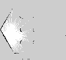

Using ``nav2``
==============

.. versionadded:: Jazzy

   This section.

.. include:: ../the_topic_is_under_heavy_construction.rst

There is a plethora of online examples of ``nav2``, with varying levels of detail and quality. My approach will top-down,
where we will see how illustrative examples and then walk through their contents.

Navigation on a known map
+++++++++++++++++++++++++

.. seealso::

    Official documentation: https://docs.nav2.org/tutorials/docs/navigation2_on_real_turtlebot3.html

In this example, our interest is looking at how navigation can be done with built-in tools, using a known *map*. A
map will have many definitions and the literature about it is extensive. For now, we can think of the map as something
usual. It points out where things are, for instance, where passable regions (such as roads) are, and possibly hazards,
obstacles, and other relevant objects.

In this example, a `TurtleBot3 <https://www.turtlebot.com/turtlebot3/>`_ will be used. As part of ``nav2_bringup``, there
is a rather complete example that we can utilize, namely :file:`tb3_simulation_launch.py`. The example can be executed
with the following command. 

.. code-block:: console

    ros2 launch nav2_bringup \
    tb3_simulation_launch.py \
    use_sim_time:=True \
    headless:=False \
    sigterm_timeout:=120

.. warning::

    The ``sigterm_timeout`` flag is particularly important. Given that some devices we use might not be powerful enough
    for all processes to finish cleanly within 5 or 10 seconds, we should add this to prevent a ``SIGTERM`` from
    being sent to the nodes. If nodes are not terminated correctly they can leave connections open, linger indefinitely,
    and cause extremely difficult-to-debug situations. This can also be dangerous when real robots are used.

We use ``headless:=False`` for the launch file to spawn :program:`Gazebo`. We use ``use_sim_time:=True`` to make sure
that :program:`Gazebo`\'s clock will be used an prevent timing issues with `/tf`.

This example will create a large number of nodes and open two screens. One of these will be for :program:`Gazebo` and
another for :program:`rviz2`. In this example, there are two actions expected from the user.

#. Set the initial *2D Pose Estimate*. This can be done through :program:`rviz2`, or :program:`ROS2` interfaces.
#. Send one or more *Nav2 Goal* \s.

An example of how to do so is shown in the video below. Please note that although I adjust :program:`Gazebo` to line
up with the :program:`rviz2` view, this is for my convenience. As long as your initial estimate is fairly accurate
the navigation should work fine.

.. raw:: html

    <iframe width="560" height="315" src="https://www.youtube.com/embed/eoZ6lu1YWQo?si=vDkECcj_1oQtgHcl" title="YouTube video player" frameborder="0" allow="accelerometer; autoplay; clipboard-write; encrypted-media; gyroscope; picture-in-picture; web-share" referrerpolicy="strict-origin-when-cross-origin" allowfullscreen></iframe>

.. warning::

    The ``jazzy`` version of this example shows a number of errors when shutting down. This might cause issues
    when the example is run repeatedly.

Unpacking the example
---------------------

Locally, you can navigate to the package using the following command.

.. code-block::

    cd $(ros2 pkg prefix nav2_bringup --share)

The installed folder will have the following structure.

.. code-block:: console

    nav2_bringup/
    ├── cmake
    │   ├── nav2_bringupConfig.cmake
    │   └── nav2_bringupConfig-version.cmake
    ├── environment
    │   ├── ament_prefix_path.dsv
    │   ├── ament_prefix_path.sh
    │   ├── path.dsv
    │   └── path.sh
    ├── launch
    │   ├── bringup_launch.py
    │   ├── cloned_multi_tb3_simulation_launch.py
    │   ├── localization_launch.py
    │   ├── navigation_launch.py
    │   ├── rviz_launch.py
    │   ├── slam_launch.py
    │   ├── tb3_loopback_simulation.launch.py
    │   ├── tb3_simulation_launch.py
    │   ├── tb4_loopback_simulation.launch.py
    │   ├── tb4_simulation_launch.py
    │   └── unique_multi_tb3_simulation_launch.py
    ├── local_setup.bash
    ├── local_setup.dsv
    ├── local_setup.sh
    ├── local_setup.zsh
    ├── maps
    │   ├── depot.pgm
    │   ├── depot.yaml
    │   ├── tb3_sandbox.pgm
    │   ├── tb3_sandbox.yaml
    │   ├── warehouse.pgm
    │   └── warehouse.yaml
    ├── package.dsv
    ├── package.xml
    ├── params
    │   ├── nav2_multirobot_params_1.yaml
    │   ├── nav2_multirobot_params_2.yaml
    │   ├── nav2_multirobot_params_all.yaml
    │   └── nav2_params.yaml
    └── rviz
        ├── nav2_default_view.rviz
        └── nav2_namespaced_view.rviz

The launch file we executed in this example is shown below. A launch file that is general will tend to have a proportional
level of complexity. We are not currently interested in dissecting all elements of this file. Rather, our interest is to
take a look at the relevant files used and what they mean. By understanding these, we would be a step closer to be able to
modify the example or interact with it for your own purposes.

.. dropdown:: Contents of :file:`tb3_simulation_launch.py`

    .. rli:: https://raw.githubusercontent.com/ros-navigation/navigation2/refs/heads/jazzy/nav2_bringup/launch/tb3_simulation_launch.py
        :language: python
        :linenos:
        :emphasize-lines: 92,103,153,163,167

The highlighted lines point out to these important files. These will guide the upcoming discussion.

- :file:`params/nav2_params.yaml`
- :file:`maps/tb3_sandbox.yaml`
- :file:`worlds/tb3_sandbox.sdf.xacro`
- :file:`urdf/gz_waffle.sdf.xacro`
- :file:`urdf/turtlebot3_waffle.urdf`

Navigation
----------

.. seealso::

    Official documentation: https://docs.nav2.org/configuration/index.html

In the example, the navigation is defined in the following configuration file.

.. dropdown:: Contents of :file:`nav2_params.yaml`

    .. rli:: https://raw.githubusercontent.com/ros-navigation/navigation2/refs/heads/jazzy/nav2_bringup/params/nav2_params.yaml
        :language: yaml
        :linenos:

Once more, there is a trade-off between generality and the complexity of the configuration file. We can unpack the major
elements of the configuration in the table below.

In ``nav2``, each functionality is divided into a so-called *server*. Each server will have its own set of parameters and
will communicate with other servers. In this topology, ideally one functionality can be modified without affecting
other servers. These are not all servers available in ``nav2``, but all the servers used in this example.

===================== ================================= =============================================================================
Server                TL;DR                             Link
===================== ================================= =============================================================================
``amcl``              Adaptive Monte-Carlo Localiser    `docs <https://docs.nav2.org/configuration/packages/configuring-amcl.html>`_
``bt_navigator``      Behavior tree navigator           `docs <https://docs.nav2.org/configuration/packages/configuring-bt-navigator.html>`_
``controller_server`` Controller server                 `docs <https://docs.nav2.org/configuration/packages/configuring-controller-server.html>`_
``local_costmap``     A 2D costmap                      `docs <https://docs.nav2.org/configuration/packages/configuring-costmaps.html>`_
``global_costmap``    A 2D costmap                      `docs <https://docs.nav2.org/configuration/packages/configuring-costmaps.html>`_
``planner_server``    Calculates path to goal           `docs <https://docs.nav2.org/configuration/packages/configuring-planner-server.html>`_
``smoother_server``   Keeps path smooth                 `docs <https://docs.nav2.org/configuration/packages/configuring-smoother-server.html>`_
``behavior_server``   Defines basic robot behaviors     `docs <https://docs.nav2.org/configuration/packages/configuring-behavior-server.html>`_
``route_server``      Handles pre-defined routes        `docs <https://docs.nav2.org/configuration/packages/configuring-route-server.html>`_
``velocity_smoother`` Smooth velocities sent to robots  `docs <https://docs.nav2.org/configuration/packages/configuring-velocity-smoother.html>`_
``collision_monitor`` Extra layer of safety             `docs <https://docs.nav2.org/configuration/packages/configuring-collision-monitor.html>`_
===================== ================================= =============================================================================

Each server can be attached to one or more ``nav2`` *plugins*. The plugins will define important aspects of the
server and plugins will have their own parameters.

.. seealso::
    Official documentation: https://docs.nav2.org/plugins/index.html

In ``nav2``, mainly, there will be a *global* planner (in this case ``nav2_navfn_planner::NavfnPlanner``) and a *local*
controller (in this case ``nav2_mppi_controller::MPPIController``). In general terms, the global planner can find solutions
when the goal is far and create a trajectory. The controller will be responsible for dealing with following the trajectory
in the short term. This split is common in robotics. Both will use costmaps, described in a following section.

The trajectories generated by the global planner might not be smooth owing to several factors, including the parameters
use to adjust execution speed. This possible jaggedness can be countered with a ``smoother_server``. Analogously, the
velocity calculated by the controller might not be smooth and, if applied directly, cause the robot to vibrate, destabilise,
wear, or break. The ``velocity_smoother`` should help to address this.

Lastly, the ``behavior_server`` will describe basic robot behaviours such as *Wait*, or *Move Straight* for a given robot.
The ``bt_navigator`` will utilise these, among other things, to decide higher level behaviour beyond the planner. A
behaviour tree can be seen as a more general state machine. Thence, as the name implies, each behaviour can branch into
different outcomes defined for each behaviour. For instance, if the robot fails reaching a goal, it can be set to do another
task or attempt to replan to another location.

map
---

The contents of :file:`nav2_params.yaml` are shown below.

.. rli:: https://raw.githubusercontent.com/ros-navigation/navigation2/refs/heads/jazzy/nav2_bringup/maps/tb3_sandbox.yaml
    :language: yaml
    :linenos:

The map will have several parameters. The global costmap is defined in ``tb3_sandbox.pgm``.

A costmap in ``nav2`` is a 2D grid in which each cell is assigned a value, similarly to an image. Using the image analogy,
each *costmap* (image) will be made of *costs* (pixels). The value in each pixel will define how *costly* it is to move
through that pixel.

Suppose that we have the small costmap below, for illustrative purposes. Suppose that we use ``F`` for free space, U
for unknown, and O for occupied. We can see this as a top-view image of the path that the robot can traverse. The planner
and controller will use this information to define how and where to navigate.

+--+------+------+--+--+
|O |O     |O     |O |U |
+--+------+------+--+--+
|O |``F`` |``F`` |O |U |
+--+------+------+--+--+
|O |O     |``F`` |O |U |
+--+------+------+--+--+
|O |``F`` |``F`` |O |U |
+--+------+------+--+--+
|O |O     |O     |O |U |
+--+------+------+--+--+

For larger maps, and to consolidate the image analogy, this is one possible representation of ``tb3_sandbox.pgm``. In this
representation, the dark pixels represent occupied regions, such as walls. The white pixel represents free movement. The
grey pixels represent unknown regions. This will be part of the so-called ``nav2_costmap_2d::StaticLayer``, representing
these three states.

Given that we are unable to fully entrust the safety of the robot to our carefully-drawn maps, ``nav2`` also allows the use
of a ``nav2_costmap_2d::ObstacleLayer``. This will be tied to one of the robot sensors, for instance, a laser scanner.
This will allow the robot to avoid obstacles when the map itself was inaccurate, for instance, if an obstacle has not
been accounted for, or account for inaccuracies in the localisation itself. The ``nav2_costmap_2d::VoxelLayer`` is used
in this example for a similar purpose, with the difference that the sensor relays 3D information that is then transformed
into relevant 2D information.

Lastly, there will be the ``nav2_costmap_2d::InflationLayer``. Given that the maps hold only three possible states for
each pixel, the changes are sudden. The inflation layer will behave similarly to a smoother. The region around each occupied
cell in the grid will be modified to show that, although that is indeed free space, the robot should not be going through
there. By assigning these costs when approaching an obstacle, planners and controllers can devise better trajectories.

The navigation file also had a local costmap, which works similarly, but can have different parameter and accept data
from different sources. The reason for this is that it is more convenient to have individual parameters for the planner
and the controller.

World and robot definition files
--------------------------------

As you might remember from the :file:`.sdf` contents, they are XML files. These files, by default, do not take advantage
of programming concepts, such as macros and conditionals. This becomes an issue when you want to make a robot description
file that is slightly more general and can be easily modified with specific parameters. Therefore you are likely to
see `xacro <https://github.com/ros/xacro>`_ being used in many ROS examples.

For instance, the :file:`tb3_sandbox.sdf.xacro` file's contents can be modified by the parameter ``headless``. Where
the parameter is defined and where it's used are highlighted in the file below. In this example, this might be a quick
patch given that :program:`Gazebo` does not seem to support it. In this example, :program:`xacro` will pre-process
the file and output a compliant :file:`.sdf` based on the value.

.. dropdown:: The contents of ``tb3_sandbox.sdf.xacro``.

    .. rli:: https://raw.githubusercontent.com/ros-navigation/nav2_minimal_turtlebot_simulation/refs/heads/jazzy/nav2_minimal_tb3_sim/worlds/tb3_sandbox.sdf.xacro
        :language: xml
        :linenos:
        :emphasize-lines: 3,14

Something similar is done to allow :program:`Gazebo` topics to have a different namespace. This is helpful when multiple
robots are added to the same :program:`Gazebo` world.

.. dropdown:: The contents of ``gz_waffle.sdf.xacro``.

    .. rli:: https://raw.githubusercontent.com/ros-navigation/nav2_minimal_turtlebot_simulation/refs/heads/jazzy/nav2_minimal_tb3_sim/urdf/gz_waffle.sdf.xacro
        :language: xml
        :linenos:

Although :file:`.sdf` files are meant to replace, or supersede, :file:`.urdf` files in the long term, the process is
still ongoing or under discussion. So it is likely that you will see :file:`.urdf` files heavily used in many :program:`ROS2`
packages. Nonetheless, :file:`.urdf` are close in syntax to :file:`.sdf` files and should be no surprise.

.. dropdown:: The contents of ``turtlebot3_waffle.urdf``.

    .. rli:: https://raw.githubusercontent.com/ros-navigation/nav2_minimal_turtlebot_simulation/refs/heads/jazzy/nav2_minimal_tb3_sim/urdf/turtlebot3_waffle.urdf
        :language: xml
        :linenos:

So what?
--------

After looking through this example you have probably noticed the complexity involved into setting up ``nav2`` for even
relatively simple projects. Having a highly configurable system increases the number of possibilities, which is great
when applying it to other settings, but might be daunting at first.

Here are some examples of what you could modify in this example and what would be the estimated difficulty of doing so.

- Changing the map. Not as trivial as it might sound, because the map needs to match the :program:`Gazebo` simulation scene. Some community `tools <https://github.com/Arseni1919/Converter_PGM_to_SDF>`_ might help with that.
- Changing the :program:`Gazebo` scene. Same problem as above, although you might benefit from SLAM, it is not likely to create a perfect map.
- Changing the robot. Online tutorials and official repositories might say that it's a matter of "changing the ``urdf`` file". Unfortunately, this might mean lots of other things will change, including the navigation parameters depending, for instance, on sensors and footprint of your robot.
- Changing planners or controllers in ``nav2``. That is going to be easier generally, but the parameters of one planner or controller might not map exactly to another one. It might take some tinkering to get it to work.

In conclusion, using this example, you have learned the basics of ``nav2`` from an official example. We went through
the importance of each file and now you should have a conceptual knowledge beyond the basics for this navigation stack.

Navigation with SLAM
++++++++++++++++++++

.. seealso::

    Official documentation: https://docs.nav2.org/tutorials/docs/navigation2_with_slam.html#navigation2-with-slam

In the previous example, we looked into navigating through a completely known map. This is a common problem to solve
in robotics, but definitely not the only issue. Commonly, we have partial or no knowledge of the map through which a
robot has to traverse. This is where SLAM kicks in. It becomes a problem of navigating through an incomplete and
dynamic map.

In this example, they make use of the `slam toolbox <https://github.com/SteveMacenski/slam_toolbox>`_. Going into the
details of SLAM is beyond the scope of this tutorial, but there are some interesting aspects to learn from this example
even with the basic concepts of navigation.

We can run the demo with SLAM using the code below. Please note that the only difference is the flag ``slam:=True``.

.. code-block:: console

    ros2 launch nav2_bringup \
    tb3_simulation_launch.py \
    use_sim_time:=True \
    headless:=False \
    sigterm_timeout:=120 \
    slam:=True

You can behold my incredible map completion skills in the video below. As you will notice it will start empty and be
completed as move around it. Using our knowledge of the environment we can know where to go to complete the map and
have good coverage. In practice, this can be challenging, when the environment is completely unknown and has more
complex topology.

.. raw:: html

    <iframe width="560" height="315" src="https://www.youtube.com/embed/7ADhJ3ZkBHI?si=cAY6uP--0ih3Redg" title="YouTube video player" frameborder="0" allow="accelerometer; autoplay; clipboard-write; encrypted-media; gyroscope; picture-in-picture; web-share" referrerpolicy="strict-origin-when-cross-origin" allowfullscreen></iframe>

Running the same demonstration a second time, we can see how to save an incomplete map. The map will be saved in the
folder in which you executed ``ros2 launch``.

.. raw:: html

    <iframe width="560" height="315" src="https://www.youtube.com/embed/ETFg4vllnBs?si=-ril5uBBOatRLeqh" title="YouTube video player" frameborder="0" allow="accelerometer; autoplay; clipboard-write; encrypted-media; gyroscope; picture-in-picture; web-share" referrerpolicy="strict-origin-when-cross-origin" allowfullscreen></iframe>

The maps will be saved into two files, compliant with ``nav2`` use. The first one we saved will be the ``.yaml`` file.

.. literalinclude:: incomplete.yaml
   :language: yaml
   :linenos:

The second one will be the map. When opened in a image viewer, this is how it looks like, showing its incomplete state.

This example is illustrative of the capacity to create maps using SLAM. This might not look like much, at first glance.
However, please take this time to reflect that this mapping is happening with simulated data coming from :program:`Gazebo`.
Therefore, it is as representative of reality as the programs we have used so far allow us to be at this point.

