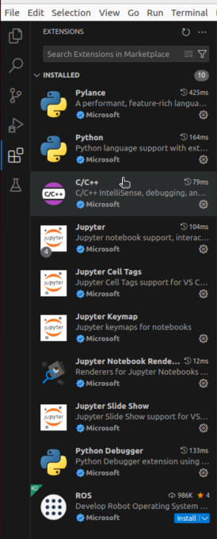
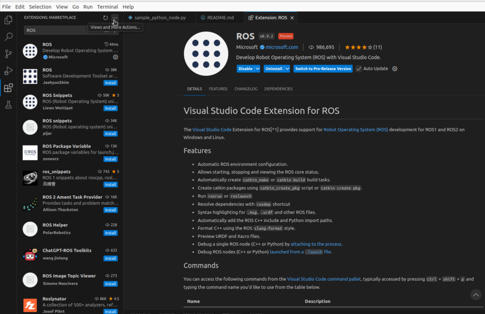

.. include:: ../../the_section_is_optional.rst

.. _Editing Python source:

Editing Python source (with :program:`VS Code`)
===============================================

.. note:
   The program you use to edit sources is an aesthetic/convenience choice. It does not affect how ROS2 works.

There are near-infinite ways to manage your Python code and, in this section, we will use :program:`VS Code`. 

Installing :program:`VS Code`
----------------------------

It is important to have a predicable enviroment for the tutorial, therefore we will download a particular version of :program:`VS Code`.
  
Run

.. code :: console

   cd ~
   mkdir ros2_workspace_vscode
   cd ros2_workspace_vscode
   wget -O code_1.93.0-stable_amd64.deb https://update.code.visualstudio.com/1.93.0/linux-deb-x64/stable
   sudo dpkg -i code_1.93.0-stable_amd64.deb
   

Running :program:`VS Code`
--------------------------

It will be installed as a regular Ubuntu application, so you can find it by searching for "Visual Studio Code". It is also beneficial to right-click the icon in search and choose "Add to Favourites".

Adding the ROS plugin to :program:`VS Code`
-------------------------------------------

Open the extensions tab with :kbd:`CTRL+SHIFT+X`.It will open a tab like so.

Search for "ROS" and click "Install". Please be careful to choose the Microsoft plugin. There are many other plugins with the same name, but made by others.

.. image:: vscode/vscode_look_install_ros.png
   :align: center

After the installation is successful, the menu will change like so. 

