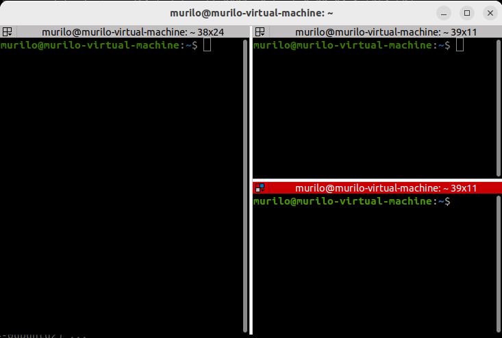
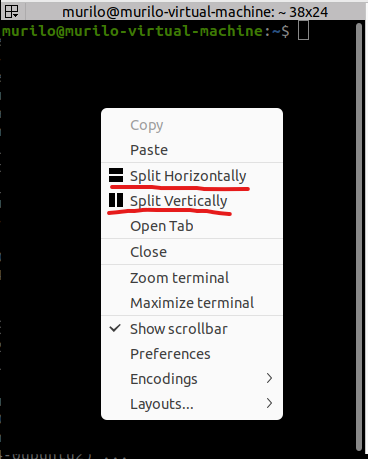

Terminator is life
==================

.. note::

   You can refer to the `project's documentation <https://terminator-gtk3.readthedocs.io/en/latest/>`_ for more info.
   
   
After installing :code:`terminator` as instructed in the last section, the default terminal window will be automatically updated to use it.

Shortcuts
---------

To prevent repetition, let's go through the most relevant `terminator shortcuts <https://terminator-gtk3.readthedocs.io/en/latest/gettingstarted.html#layout-shortcuts>`_ only once, here, now.

.. csv-table:: Terminator Shortcuts
   :file: terminator_shortcuts.csv
   :widths: 30, 70
   :header-rows: 1

For example, pressing the following combination:

1. :code:`CTRL+ALT+T`
2. :code:`SHIFT+CTRL+E`
3. :code:`SHIFT+CTRL+O`

Will result in three terminal windows that look like so.

OK, but what if shortcuts scare me
----------------------------------

Instead of using shortcuts, a context menu can be opened by right-clicking a terminal window. 
Then, you can choose to `Split Horizontally` or `Split Vertically` to achieve the same results.

